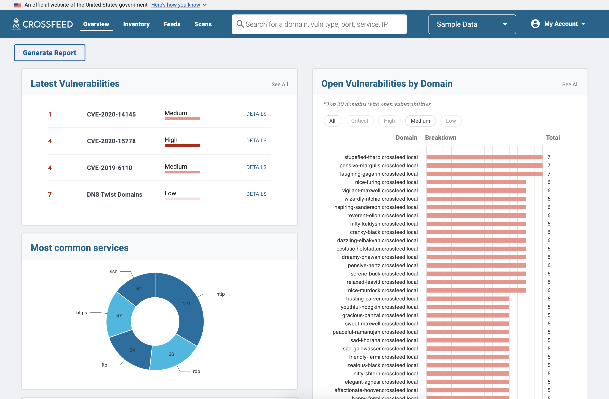
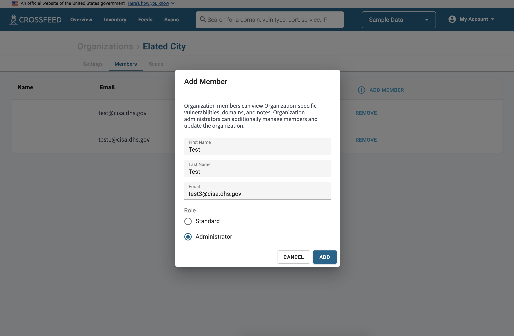
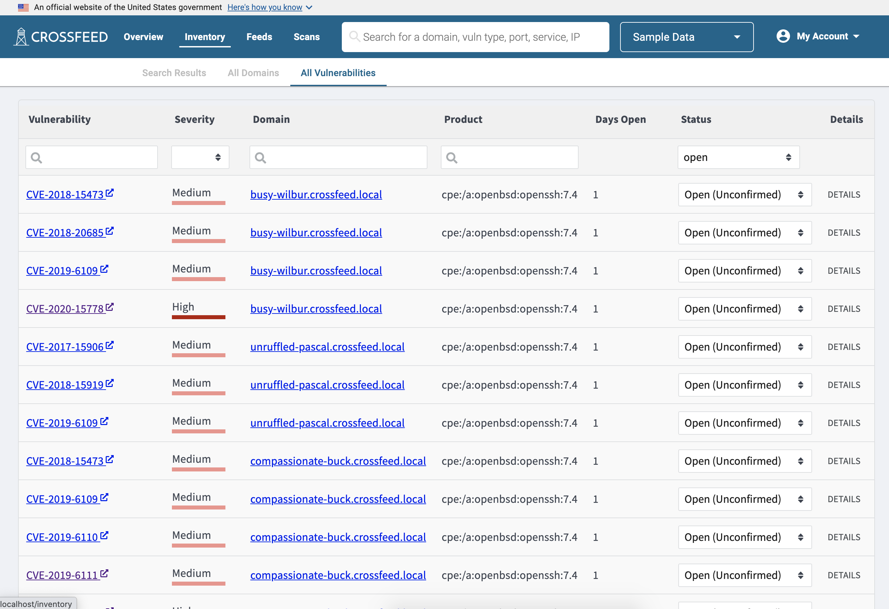
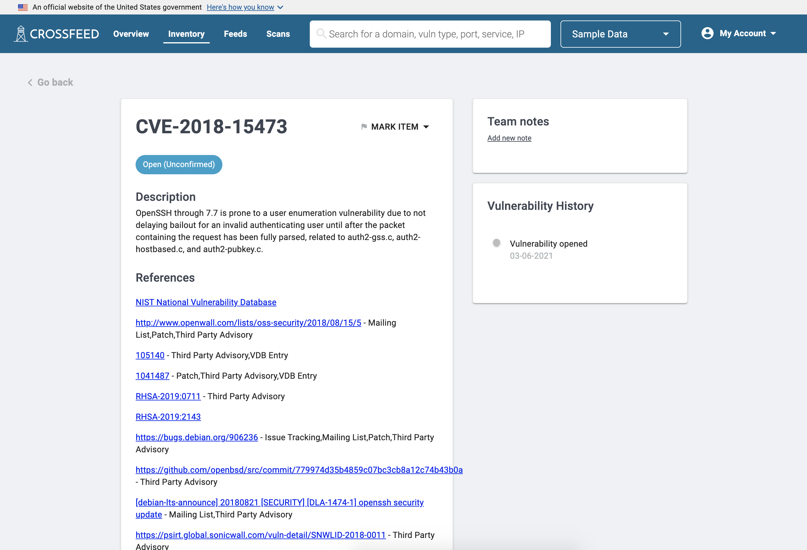
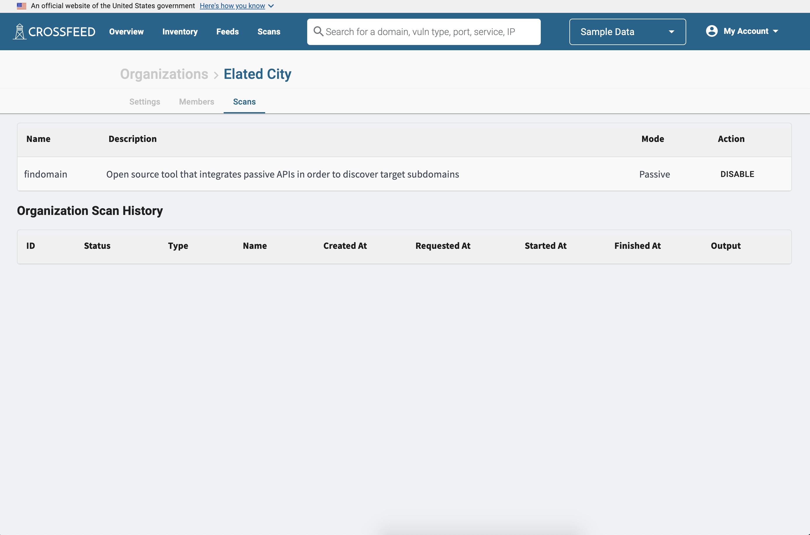

  

  <h4 class="usa-alert__heading">Note</h4>
    

      While CISA's instance of Crossfeed is currently not accepting public enrollment, it is developed as an open-source tool available on GitHub. The below instructions describe how users can use Crossfeed if granted access to CISA's instance of Crossfeed. If you are a developer and want to set up your own Crossfeed instance, see <a href="/dev/own-instance/">Creating your own instance of Crossfeed</a>.
    

  

### Accepting an Invite

Standard users of Crossfeed can only access the platform after being invited to
an organization by another user. When invited, you will receive an email invite
to a Crossfeed organization. You will then be prompted to create a user account.

### Overview

Once you are logged in, you can view an overview of your organization's domains
and risk summary on the "Overview" pane.

### Inviting others

To invite others to your Crossfeed organization, go to My Account -> Manage Organizations and select your organization. Then go to the "Members" tab.

You can add additional users to invite to Crossfeed. All users can view your organization's data, including domains and vulnerabilities. You have two options:

- **Standard:** allows the user only view access to data.
- **Administrator:** allows the user to view data, invite or remove other users, and turn on / off scans.

Once you invite a user, they will receive an invitation email with instructions on how to sign up if they do not already have a Crossfeed account.

### Adding root domains

Crossfeed stores a list of **root domains** for each organization. Each root domain and all its subdomains will be scanned by Crossfeed. For example:

- A root domain of **cyber.dhs.gov** will scan cyber.dhs.gov, as well as other subdomains such as crossfeed.cyber.dhs.gov and staging.crossfeed.cyber.dhs.gov.
- A root domain of **cisa.gov** will scan cisa.gov as well as all subdomains, including www.cisa.gov and presidentscup.cisa.gov.

To view which root domains are assigned to your organization, go to My Account -> Manage Organizations and select your organization. Navigate to the "Settings" tab.

If you would like to modify the root domains being scanned for your organization, please send an email to vulnerability@cisa.dhs.gov with the requested changes.

### Viewing assets

You can search for anything, which returns search results, then filter those results. Each search result represents a domain, which can have ports, products, and vulnerabilities associated with it.

The "All Domains" list contains a more compact representation of all domains.

The "All Vulnerabilities" list has a list of all vulnerabilities. Each vulnerability is associated with a specific domain; vulnerabilities include CVEs as well as other issues such as SSL configuration or misconfiguration errors.

You can also view details of an individual domain.

Finally, you can click on a vulnerability to view more information about it, such as references to links with more information about it, as well as its history and any notes that other Crossfeed users may have added to it. You can also mark a vulnerability as a false positive from this page.

### Tailoring data sources

Crossfeed has two types of scans: active and passive.

- **Passive:** Querying data in a non-invasive manner. This includes querying an internal data source or third-party API, or light web traffic (e.g. visiting the index web page of a domain).
- **Active:** Actively making network requests to target assets in order to identify vulnerabilities. All scans, even if used to detect vulnerabilities, are designed to not be disruptive and do not go beyond benign vulnerability payloads. This also includes more heavy traffic operations such as directory brute forcing.

You can turn on / off some scans for your organization. To do so, go to My Account -> Manage Organizations and select your organization. Navigate to the "Scans" tab. Here, you can toggle different scans on or off.

If you would like only passive scans to run on your organization (and disable active scans), go to My Account -> Manage Organizations and select your organization. Navigate to the "Settings" tab. You can then turn on "Passive Mode" to only enable passive scans on your organization.

